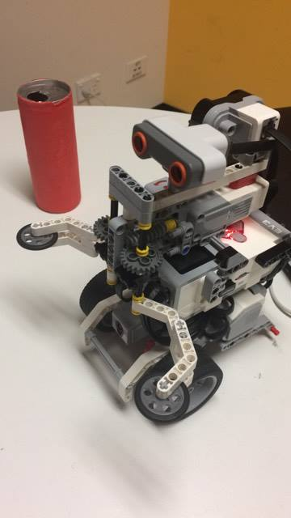

# ENGG1000 Project - Robot Rescue - Semester 1 2017

The ENGG1000 Project related to Computer Science and Software Engineering involved creating an autonomous robot to traverse a maze and rescue a victim. This was done by building a robot using a Lego Mindstorms EV3 kit, while programming it with the python ev3dev module.

As a precedent to the final assignment, a Robot Sumo competition was held, where the robot was programmed to fight against another robot and push them out of a ring.

Both personal and group blogs were written up each week reflecting on the team's progress with the project.

Useful links:

  1. [ev3dev main website](http://www.ev3dev.org/)
  2. [ev3dev documentation](http://python-ev3dev.readthedocs.io/en/stable/)
  
